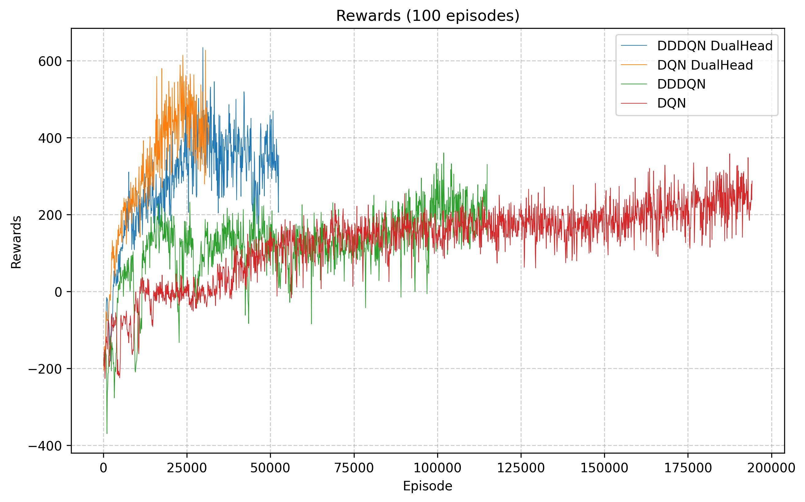
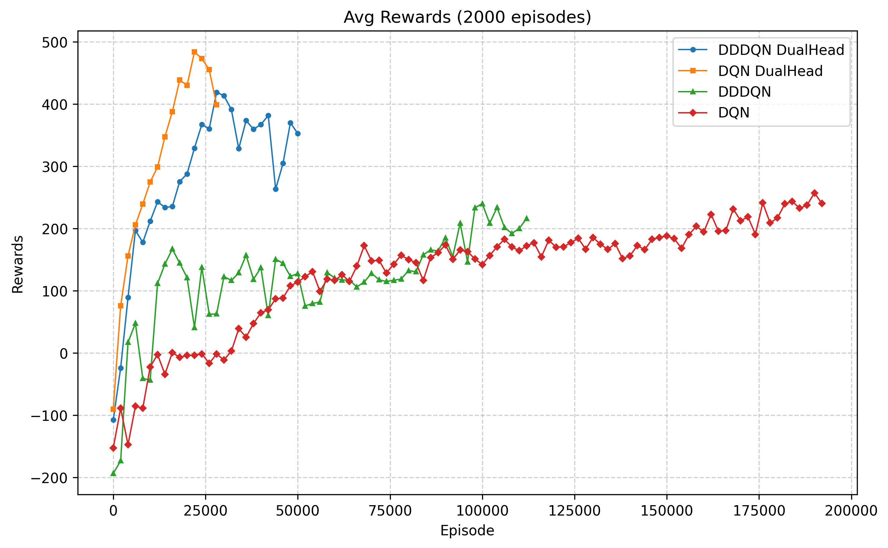
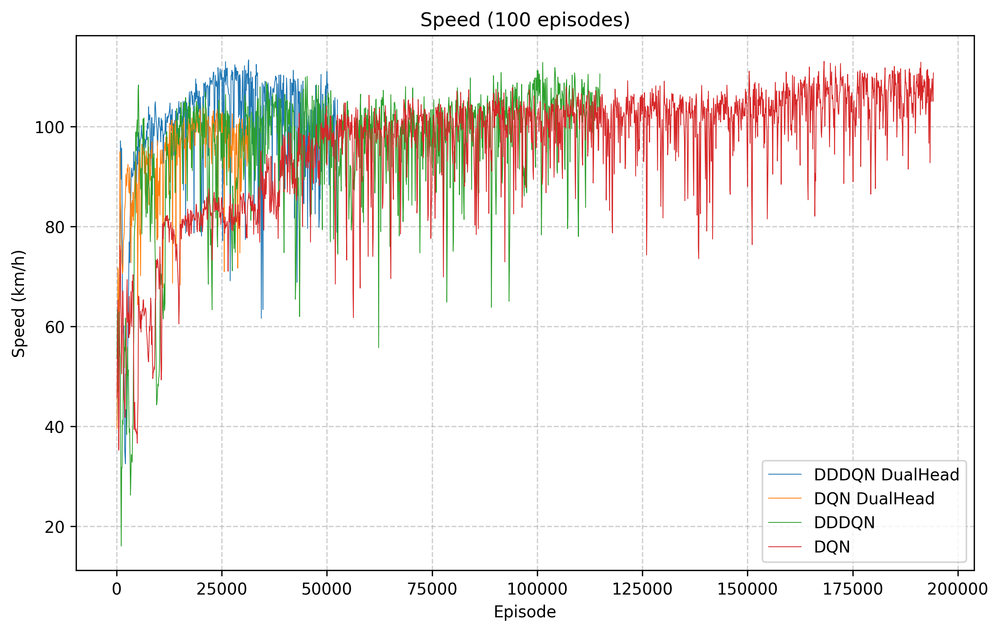
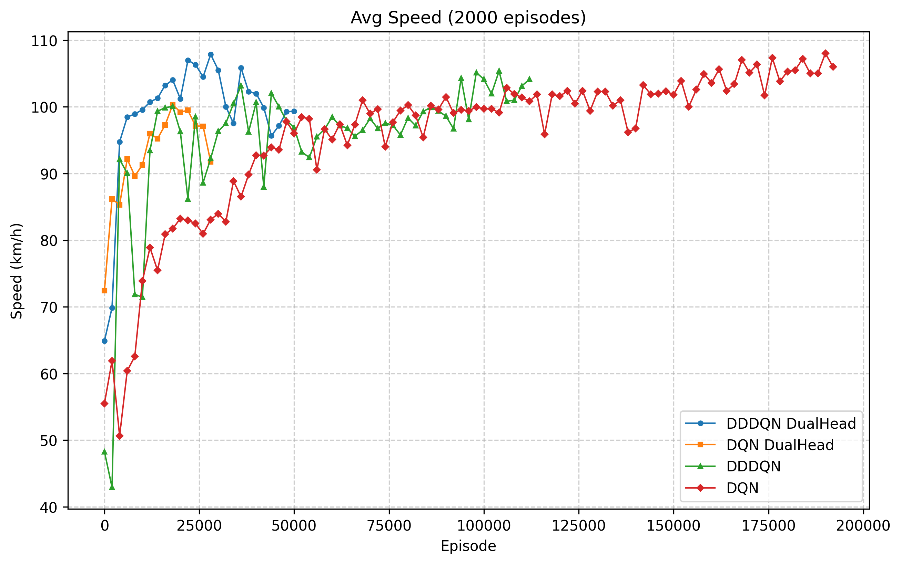
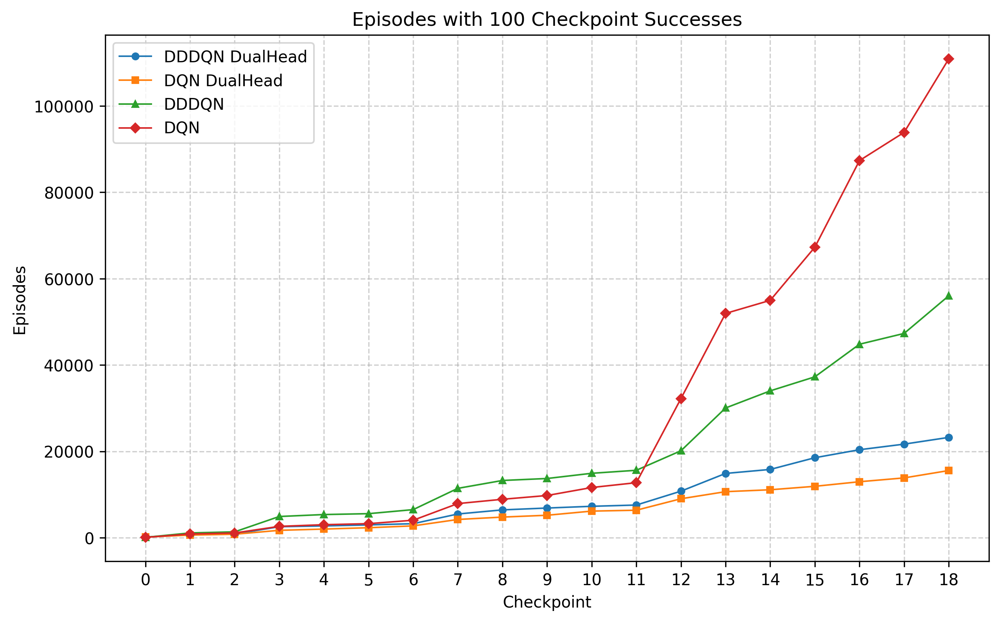

# Traffic Control with Reinforcement Learning

이니셜D 스타일 드리프트 레이싱 게임을 위한 강화학습 에이전트 학습 프로젝트입니다. DQN과 Dueling Double DQN (DDDQN) 알고리즘을 사용하여 자율 주행 레이싱 에이전트를 학습시킵니다.

## 📋 목차

- [프로젝트 개요](#프로젝트-개요)
- [주요 기능](#주요-기능)
- [프로젝트 구조](#프로젝트-구조)
- [설치 및 요구사항](#설치-및-요구사항)
- [사용 방법](#사용-방법)
- [알고리즘 설명](#알고리즘-설명)
- [파일 설명](#파일-설명)
- [학습 파라미터](#학습-파라미터)
- [결과 분석](#결과-분석)

## 🎯 프로젝트 개요

이 프로젝트는 2D 탑뷰 레이싱 게임 환경에서 강화학습을 통해 자율 주행 에이전트를 학습시키는 시스템입니다. 

**주요 특징:**
- 이니셜D 스타일의 드리프트 물리 시뮬레이션
- DQN 및 Dueling Double DQN 알고리즘 지원
- Action과 Duration을 동시에 예측하는 Dual-head 아키텍처
- Headless 모드로 빠른 학습 가능
- 커스텀 트랙 에디터 제공

## ✨ 주요 기능

### 1. 강화학습 알고리즘
- **DQN (Deep Q-Network)**: 기본 DQN 알고리즘
- **DDDQN (Dueling Double DQN)**: 
  - Double DQN: Q값 과대평가 방지
  - Dueling DQN: Q = V(s) + A(s,a) 분해로 효율적 학습

### 2. 네트워크 아키텍처
- **Single-head**: Action만 예측
- **Dual-head**: Action과 Duration을 동시에 예측
  - Shared layers로 특징 추출
  - Action head와 Duration head로 분리
  - Loss = action_loss + 0.2~0.3 * duration_loss

### 3. 학습 최적화
- **Segment-based Epsilon Decay**: 트랙 체크포인트 별로 epsilon을 독립적으로 관리
- **Frame Skipping**: Action 단위로 transition 저장하여 효율성 향상
- **Headless Mode**: 렌더링 없이 빠른 학습

### 4. 게임 환경
- **드리프트 물리**: 카운터 스티어링, 드리프트 모멘텀, 드리프트 부스트
- **센서 시스템**: 12방향 거리 센서
- **체크포인트 시스템**: 구간별 학습 및 평가
- **커스텀 트랙**: 트랙 에디터로 자유롭게 트랙 생성

## 📁 프로젝트 구조

```
traffic_control_with_RL-main/
├── env/                         # 게임 환경
│   ├── racing_game_2d.py        # 레이싱 게임 메인 엔진
│   ├── track_editor.py          # 트랙 에디터
│   ├── track.json               # 트랙 데이터
│   └── racing_car.json          # 차량 설정
├── train/                       # 학습 스크립트
│   ├── train_agent_dqn_withEval.py              # DQN 학습
│   ├── train_agent_dqn_withEval_multiHead.py    # DQN Dual-head 학습
│   ├── train_agent_dddqn_withEval.py           # DDDQN 학습
│   └── train_agent_dddqn_withEval_multiHead.py # DDDQN Dual-head 학습
├── evaluation/                   # 평가 스크립트
│   ├── evaluation_dqn.py                        # DQN 평가
│   ├── evaluation_dqn_dualHead.py               # DQN Dual-head 평가
│   ├── evaluation_dddqn.py                      # DDDQN 평가
│   └── evaluation_dddqn_dualHead.py             # DDDQN Dual-head 평가
├── example_models/              # 학습된 모델 예제
├── log_files/                   # 학습 로그 파일
├── reward_function.py           # 보상 함수
├── analysis.py                  # 로그 분석 도구
└── README.md                    # 이 파일
```

## 🔧 설치 및 요구사항

### 시스템 요구사항
- Python 3.7 이상
- CUDA 지원 GPU (선택사항, CPU도 가능)

### 의존성 설치

```bash
pip install -r requirements.txt
```

### 주요 의존성 패키지
- `pygame`: 게임 렌더링 및 입력 처리
- `torch`: PyTorch 딥러닝 프레임워크
- `numpy`: 수치 연산
- `matplotlib`: 결과 분석 및 시각화

## 🚀 사용 방법

### 1. 트랙 생성 (선택사항)

기본 `track.json`을 사용하거나, 커스텀 트랙을 만들 수 있습니다:

```bash
cd env
python track_editor.py
```

**트랙 에디터 사용법:**
- 마우스 드래그: 자유 곡선 그리기
- `L`: 직선 툴
- `C`: 베지어 곡선 툴
- `E`: 지우개
- `S`: 시작점 설정
- `G`: 골인점 설정
- `1-n`: 체크포인트 추가
- `+/-`: 트랙 굵기 조절
- `Ctrl+S`: 저장

### 2. 차량 설정 수정 (선택사항)

`env/racing_car.json` 파일을 수정하여 차량 물리 파라미터를 조정할 수 있습니다:

```json
{
    "max_speed": 1000,              // 최대 속도
    "acceleration_force": 600,      // 가속력
    "friction": 0.99,               // 공기저항
    "lateral_friction": 0.85,       // 측면 그립
    "turn_speed": 3,                // 회전 속도
    "drift_friction": 0.1,          // 드리프트 마찰
    "sensor_range": 300            // 센서 범위
}
```

### 3. 학습 실행

#### DQN 학습 (Single-head)
```bash
cd train
python train_agent_dqn_withEval.py --layer_num 4 --max_size 2048 --lr 0.0003 --batch_size 512
```

#### DQN Dual-head 학습
```bash
python train_agent_dqn_withEval_multiHead.py --layer_num 4 --max_size 2048 --lr 0.0003 --batch_size 512
```

#### DDDQN 학습 (Single-head)
```bash
python train_agent_dddqn_withEval.py --layer_num 4 --max_size 2048 --lr 0.0003 --batch_size 512
```

#### DDDQN Dual-head 학습
```bash
python train_agent_dddqn_withEval_multiHead.py --layer_num 4 --max_size 2048 --lr 0.0003 --batch_size 512
```

**주요 파라미터:**
- `--layer_num`: 네트워크 레이어 수 (기본값: 4)
- `--max_size`: 첫 번째 레이어의 뉴런 수 (기본값: 2048)
- `--lr`: 학습률 (기본값: 0.0003)
- `--batch_size`: 배치 크기 (기본값: 512)

### 4. 모델 평가

학습된 모델을 시각적으로 평가할 수 있습니다:

```bash
cd evaluation
python evaluation_dqn.py --model_path ../example_models/dqn_best_*.pth
```

또는 Dual-head 버전:
```bash
python evaluation_dqn_dualHead.py --model_path ../example_models/dqn_dualhead_best_*.pth
```

### 5. 로그 분석

학습 로그를 분석하여 성능을 확인할 수 있습니다:

```bash
python analysis.py
```

## 🧠 알고리즘 설명

### DQN (Deep Q-Network)
기본 DQN 알고리즘으로, Q-learning을 딥러닝으로 확장한 방법입니다.

**특징:**
- Experience Replay 사용
- Target Network로 안정적 학습
- Epsilon-greedy 탐험 전략

### Dueling Double DQN (DDDQN)

**Double DQN:**
- Target Q값 계산 시 현재 네트워크로 action 선택
- Q값 과대평가 문제 완화

**Dueling DQN:**
- Q(s,a) = V(s) + (A(s,a) - mean(A))
- V(s): 상태 가치 (State Value)
- A(s,a): 행동 이점 (Advantage)
- 상태 가치와 행동 이점을 분리하여 학습 효율 향상

### Dual-head 아키텍처

Action과 Duration을 동시에 예측하는 구조:

```
Input State
    ↓
Shared Layers (Feature Extraction)
    ↓
    ├─→ Action Head → Action Q-values
    └─→ Duration Head → Duration Q-values
```

**Loss 함수:**
```
Total Loss = Action Loss + α * Duration Loss
(α = 0.2 ~ 0.3)
```

## 📄 파일 설명

### 환경 파일

#### `env/racing_game_2d.py`
레이싱 게임 메인 엔진입니다.

**주요 클래스:**
- `Car`: 차량 물리 시뮬레이션 (드리프트, 카운터 스티어링 등)
- `RacingGame`: 게임 로직 및 렌더링

**주요 메서드:**
- `step(controls)`: 게임 한 프레임 진행
- `reset()`: 게임 리셋
- `run()`: 수동 플레이 모드

#### `env/track_editor.py`
트랙을 생성하고 편집하는 GUI 도구입니다.
직접 트랙을 생성할 수 있습니다.

#### `env/track.json`
트랙 데이터 (마스크, 시작점, 골인점, 체크포인트)

#### `env/racing_car.json`
차량 물리 파라미터 설정

### 학습 파일

#### `train/train_agent_dqn_withEval.py`
기본 DQN 학습 스크립트입니다.

**주요 기능:**
- Headless 모드 학습
- Segment-based epsilon decay
- 주기적 모델 평가 및 저장
- 로그 파일 자동 생성

#### `train/train_agent_dqn_withEval_multiHead.py`
DQN Dual-head 버전입니다.

**차이점:**
- Action과 Duration을 동시에 예측
- Duration은 3, 6, 9, ... 프레임으로 매핑

#### `train/train_agent_dddqn_withEval.py`
Dueling Double DQN 학습 스크립트입니다.

#### `train/train_agent_dddqn_withEval_multiHead.py`
DDDQN Dual-head 버전입니다.

### 평가 파일

#### `evaluation/evaluation_*.py`
학습된 모델을 시각적으로 평가하는 스크립트입니다.

**기능:**
- 렌더링 모드로 에이전트 주행 확인
- 성공률 및 평균 시간 계산
- 여러 모델 비교 평가

### 기타 파일

#### `reward_function.py`
보상 함수 정의입니다.

**보상 구성:**
- 충돌: -200
- 골인: 100 + 시간 보너스 (최대 600)
- 진행 거리: (이전 거리 - 현재 거리) * 0.1
- 속도: 정규화된 속도 * 0.3
- 드리프트: 상황에 따라 보너스/페널티
- 체크포인트: 50 (속도에 따라 가중치 적용)

#### `analysis.py`
학습 로그 파일을 분석하는 도구입니다.

**분석 항목:**
- 100 에피소드마다 평균 보상
- 세그먼트 학습 완료 시점
- 평가 성공률 및 평균 시간

## ⚙️ 학습 파라미터

### 네트워크 구조
- **Input Size**: 28 (센서 12 + 각도 2 + 속도 3 + 거리/각도 2 + 드리프트 1 + 차량 특성 8)
- **Action Size**: 6 (직진, 직진+좌, 직진+우, 드리프트 좌, 드리프트 우, 브레이크)
- **Duration Size**: 6~10 (Dual-head 버전)

### 하이퍼파라미터
- **Learning Rate**: 0.0001 ~ 0.0003
- **Gamma (Discount Factor)**: 0.99
- **Epsilon Decay**: 0.995 ~ 0.998
- **Replay Memory Size**: 100,000
- **Batch Size**: 512 ~ 2048
- **Target Update**: 2000 ~ 5000 steps

### 학습 전략
- **Segment-based Learning**: 트랙을 체크포인트로 구간 분할, 각 구간별로 독립적으로 학습
- **Frame Skipping**: Action을 여러 프레임 동안 유지
- **Early Stopping**: 500회 평가에서 개선 없으면 종료

## 📊 결과 분석

### 로그 파일 형식

학습 중 생성되는 로그 파일은 다음 정보를 포함:

```
[Ep XXXXX] Goal: XXX | Seg: X | ε: X.XXX | Reward: XXXXX.X | 
A_Loss: X.XXX | D_Loss: X.XXX | Speed: X.X ep/s | 
Avg Speed: XX.XX km/h | Time: HH:MM:SS
```

### 모델 저장 형식

최고 성능 모델은 다음 형식으로 저장됨:

```
{algorithm}_best_lr_{lr}_L{layer_num}_S{max_size}_E{episode}_T{time}.pth
```

예: `dqn_best_lr_0_0003_L4_S2048_E53475_T133_613.pth`

### 평가 기준

모델은 다음 조건을 만족할 때 저장됨:
1. 10회 평가에서 100% 성공률
2. 이전 최고 기록보다 평균 시간이 개선

### 시각적 지표 비교

| 구분 | 100 에피소드 단위 (Raw) | 2,000 에피소드 단위 (Smoothed) |
| :--- | :---: | :---: |
| **보상 (Reward)** |  |  |
| **주행 속도 (Speed)** |  |  |

#### [구간별 학습 효율 (Checkpoint Progress)]

> 각 체크포인트(Segment)를 100회 통과하는 데 소요된 에피소드 수입니다. 그래프가 아래쪽에 위치할수록 해당 구간을 더 적은 시행착오로 마스터했음을 의미.

---

### 주요 분석 인사이트

#### 💡 Dual-head 아키텍처의 성능 우위
본 프로젝트의 핵심 차별점은 에이전트가 액션의 **지속 시간(Duration)**을 스스로 결정하느냐에 있음.

* **Single-head (Fixed Duration):** 브레이크는 2프레임, 그 외 모든 액션은 5프레임으로 고정되어 있음. 조작의 유연성이 부족하여 복잡한 코너에서 세밀한 라인 수정이 어려움.
* **Dual-head (Dynamic Duration):** 모델이 현재 상태를 판단하여 액션과 함께 해당 액션을 유지할 프레임 수(Duration)를 동시에 예측함.
* **분석 결과:** Dual-head를 적용한 DQN 및 DDDQN 모델이 비적용 모델 대비 압도적으로 높은 Reward를 획득했습니다. 이는 유동적인 조향 제어가 드리프트 및 코너링 성능에 결정적인 요소임을 보여줌.

#### 🏎️ 속도 및 주행 효율
* **최고 속도:** 모든 모델이 학습 후반부에는 유사한 최고 속도에 도달하지만, **Dual-head 모델**이 훨씬 적은 에피소드 내에 최고 속도 주행 라인을 확보함.
* **학습 안정성:** DDDQN 기반의 Dual-head 모델은 Q-value의 과대평가를 억제하면서 정교한 지속 시간 제어를 더해 가장 안정적인 주행을 보여줌.

---

### 학습 모델별 상세 결과 (`example_models`)

현재 제공되는 주요 모델들의 학습 로그 통계입니다. 하이퍼파라미터(`lr`, `L`, `S`)에 따른 효율 차이를 확인할 수 있음.

| 모델 파일명 | 총 에피소드 | 총 골인 횟수 | 학습 시간 (분) | 주요 특징 |
| :--- | :---: | :---: | :---: | :--- |
| `dqn_best_..._L3_S512_...` | 194,285 | 746 | 452.9 | 기본적인 DQN의 성능 기준점 |
| `dqn_dualhead_..._L3_S1024_...` | 31,685 | 1,099 | **92.7** | 가장 빠른 수렴 및 고효율 달성 |
| `dddqn_best_..._L3_S1024_...` | 114,925 | 575 | 232.4 | Single-head 중 상대적으로 안정적 |
| `dddqn_dualhead_..._L4_S2048_...` | 52,556 | 937 | 139.8 | 고차원 네트워크를 통한 정교한 제어 |

---

### 📝 참고 및 제약 사항
* **하이퍼파라미터 영향:** `layer_num`, `max_size`, `lr` 설정값에 따라 성능 편차가 매우 큽니다. 특히 Dual-head 모델은 네트워크의 크기가 클수록 지속 시간 예측의 정밀도가 향상되는 경향 존재.
* **환경 설정:** 차량 물리 파라미터(Lateral Friction, Drift Friction 등)의 작은 변경도 기존 학습 모델의 성공률에 큰 영향을 미치므로 환경 설정과 에이전트 튜닝의 조화가 중요.

## 🎮 게임 플레이

수동으로 게임을 플레이할 수 있습니다:

```bash
cd env
python racing_game_2d.py
```

**조작법:**
- `↑`: 가속
- `↓`: 후진/브레이크
- `←→`: 조향
- `SPACE + ←/→`: 드리프트 시작
- `R`: 리셋

**드리프트 팁:**
1. 속도를 충분히 올린다 (150+ 필요)
2. SPACE + 방향키로 드리프트 진입
3. 반대 방향키(카운터 스티어)로 각도 조절
4. SPACE 떼면 드리프트 종료 + 부스트!

## 🔍 문제 해결

### 학습이 느린 경우
- Headless 모드 사용 확인
- GPU 사용 여부 확인 (`torch.cuda.is_available()`)
- Batch size 조정
- 네트워크 크기 축소

### 모델이 골인하지 못하는 경우
- 학습 에피소드 수 증가
- Epsilon decay rate 조정
- 보상 함수 파라미터 조정
- 트랙 난이도 조정

### 메모리 부족 오류
- Replay memory size 감소
- Batch size 감소
- 네트워크 크기 축소

## 📝 참고사항

- 학습은 수만~수십만 에피소드가 소요될 수 있습니다
- GPU 사용 시 학습 속도가 크게 향상됩니다
- 로그 파일은 `log_files/` 디렉토리에 저장됩니다
- 최고 모델은 `example_models/` 디렉토리에 저장됩니다
- 트랙과 차량 설정에 따라 학습 난이도가 달라집니다

## 📄 라이선스

이 프로젝트는 교육 및 연구 목적으로 제공됩니다.

## 🚀 추후 진행해볼 사항
- DQN, DDDQN 뿐 아니라 학습의 안정성을 위한 PPO 및 DPO도 진행.
- 하나의 차량으로 진행하는 것을 넘어, 각각이 목적지를 가진 여러 차량이 실제 도로 환경에서 주행하는 환경도 구현.